# RT Project Manager

This is an extension to create and manage projects that using RTLib library

## Features

Allow user to create project inside visual studio code workspace system  
Provide ability to config the project after the project is created

## Requirements

Require extension Cortex Debug and set up proper JLink Path in Cortex Debug extension

## Usage
1. Click RT Project Manager icon in view container 
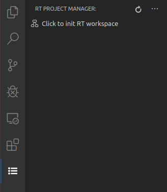 
2. Click the `Click to init RT workspace` button to initialize the workspace 
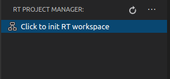 
3. Select the location of the workspace and name the workspace 
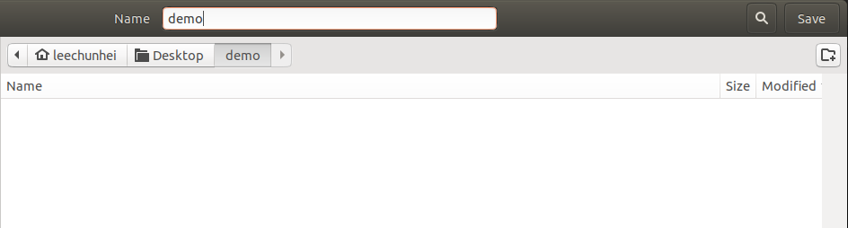 
4. Select the folder of the RTLib library 
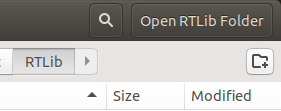 
5. New workspace should opened with RTLib folder in it 
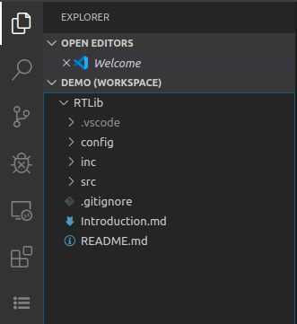 
6. Click RT Project Manager icon in view container again and click new project 
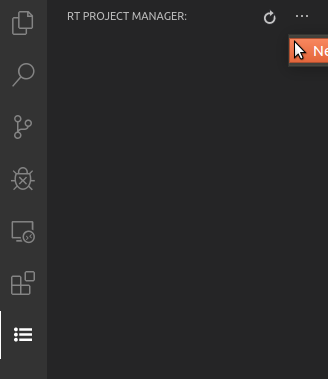 
7. Create project by filling the information in the create project webview 
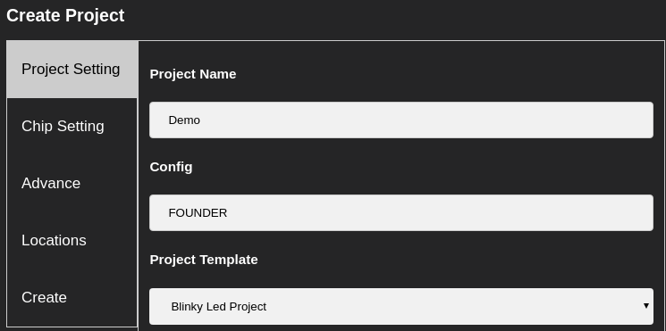 
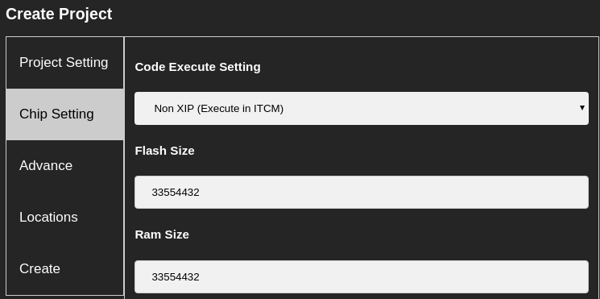 
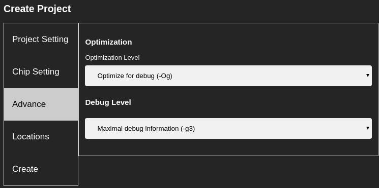 
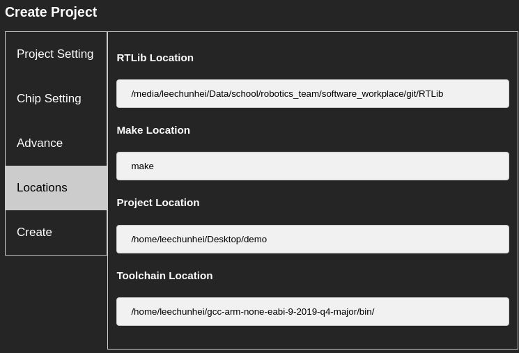 
8. The template main.cpp will be opened after the project is successfully created 
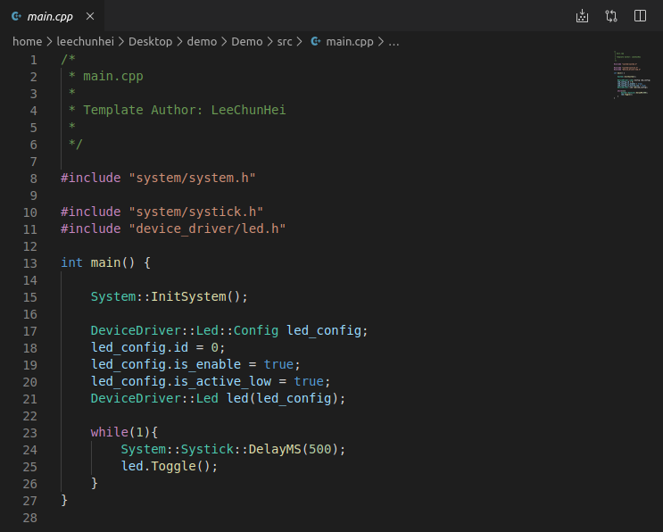 
9. Click the `Property` button of the project in RT Project Manager Treeview to further config the corresponding project 
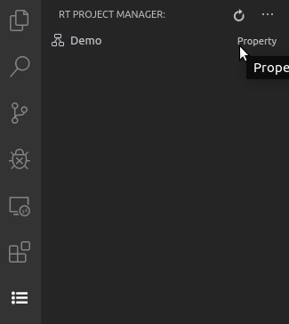 
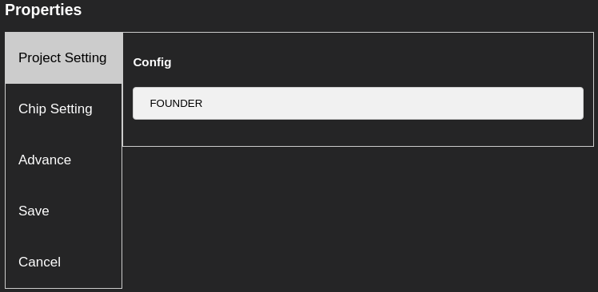 
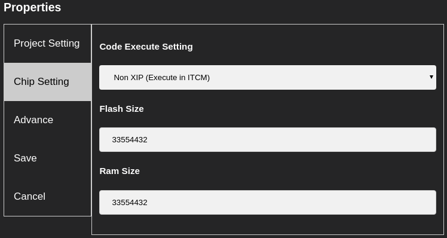 
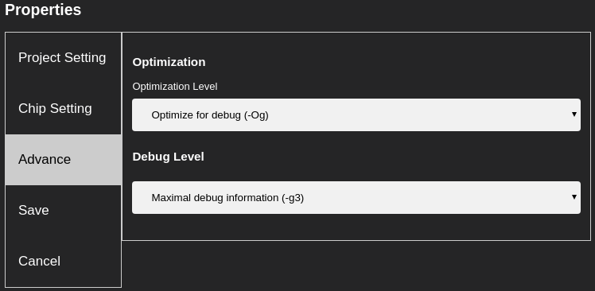 

## Extension Settings

This extension contributes the following settings:

* `rt-project-manager.rtlibPath`: the path to the RTLib folder, will auto complete when workspace is initialized with this extension
* `rt-project-manager.make`: default path to the make program, will be update every time when it is changed during project creation
* `rt-project-manager.flash_size`: default value for the flash size, will be update every time when it is changed during project creation
* `rt-project-manager.ram_size`: default value for the ram size, will be update every time when it is changed during project creation

## Known Issues

None

## Release Notes

### 1.0.2

Fix incorrect behaviour when empty file with extension name start with h is opened

### 1.0.1 Insignificant Fix

Update README. 
Correct the grammatical mistakes in extension description.

### 1.0.0 First Release

Basic of the extension is completed. 
RT chip project library can be created and config with this extension